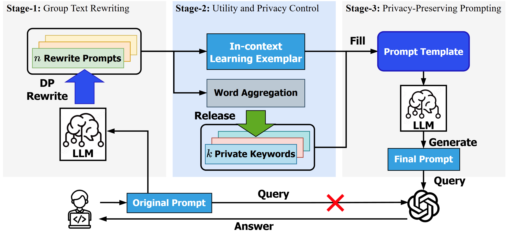

# The code repo for DP-GTR 
DP-GTR is a three-stage differentially private prompt protection framework designed to safeguard text inputs in client-side applications. Leveraging our novel Group Text Rewriting (GTR) mechanism, DP-GTR seamlessly bridges local and global differential privacy (DP) paradigms, enabling the integration of diverse DP techniques for superior privacy-utility tradeoffs.



## How to use
1. Setup the OpenAI API keys. (We use Azure OpenAI API)
```json
{
    "api_key": "",
    "api_base": "",
    "api_type": "azure",
    "api_version": "",
    "deployment_name": {
        "GPT3.5": "GPT35", 
    }
}
```

2. Define your own dp paraphrase function and call the gtr to Group Text Rewrite the input text.
```python
from GTR import GTR
from openai_generation import dp_paraphrase, generate
gtr = GTR()
input_text = "In which year, john f. kennedy was assassinated?"
rewrites = gtr.gtr(input_text, dp_paraphrase, temperature=1.0)
print(rewrites)
```

3. Build final prompt from contextual rewrites.
```python
final_prompt = gtr.icl(rewrites, generate)
```

See the `test.ipynb` for more details.

## DP-GTR parameters
- `num_rewrites`: The number of rewrites to generate.
- `releasing_strategy`: either `ndp`(non-dp) or `jem`(Joint-EM).
- `remian_tokens`: The number of tokens to release and avoid in final generation. 

## Use Open-source LLM
We also provide the code to use the open-source LLMs like Llama-3.1-8B, GPT-2, etc. 
```python
from dpps.SLM import SLM
from utils import prompt_template
slm = SLM("meta-llama/Llama-3.1-8B-Instruct")

text = slm.generate_clean(input_text=prompt_template(text), ref_text=text)
```

Use `slm.clip_model()` to clip the model's sensitivity bound before rewriting.

# Examples
Document: 
```
In which year, john f. kennedy was assassinated?
```
10 DP-guaranted paraphrase:
```
In what year was John F. Kennedy killed?
What year was John F. Kennedy assassinated?
During which year did John F. Kennedy get assassinated?
In what year was John F. Kennedy killed?
What year did John F. Kennedy get assassinated?
In what year was John F. Kennedy killed?
What year did John F. Kennedy get assassinated?
In what year was John F. Kennedy killed?
What year did John F. Kennedy get shot?
In what year did John F. Kennedy get killed?
```
**Private keywords**:
```
What, get, Kennedy, killed, In, John, assassinated, F., year, During
```
**Reference**:
```
What year was John F. Kennedy assassinated?
```
**Final Prompt**:
```
When did the tragic event occur involving the 35th President of the United States?
```


# Citation
If you find DP-GTR useful, please cite here:

```
@article{li2025dp,
  title={DP-GTR: Differentially Private Prompt Protection via Group Text Rewriting},
  author={Li, Mingchen and Fan, Heng and Fu, Song and Ding, Junhua and Feng, Yunhe},
  journal={arXiv preprint arXiv:2503.04990},
  year={2025}
}
```

# Acknowledgements
[Responsible AI Lab](https://rlab.unt.edu/), University of North Texas
